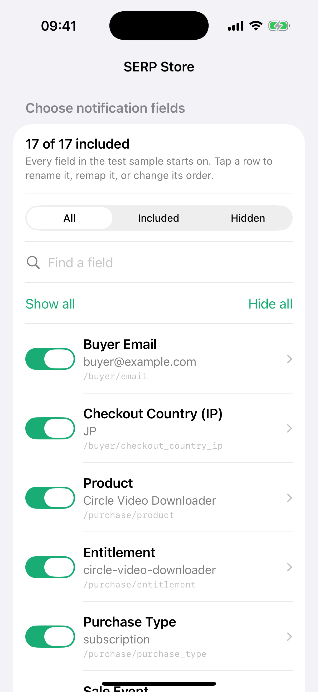

# Custom Webhook Payment Sources

## User outcome

A signed-in user can connect any store or payment system that can send JSON to a webhook, without Cha-Ching needing provider-specific code.

## Setup experience

1. Tap **Connect another payment source** and give it a recognizable name.
2. Copy either the private webhook URL or the ready-made **AI agent / developer** prompt. The prompt includes the URL, security rules, request contract, setup steps, test expectations, retry check, and completion checklist.
3. Send one test event, then tap **Check connection** in Cha-Ching.
4. Match the observed fields to Payment ID, Amount, Currency, and optional Time, Product, Plan, and Sale type.
5. Customize the notification. Every observed scalar field appears and starts on. The compact list shows its label, sample value, and source path. The user can search, filter by **All / Included / Hidden**, toggle a row directly, or tap it to rename, remap, and move it earlier or later. **Show all** and **Hide all** remain available.
6. Review the exact notification body and activate the source.

The sender owns the payload shape. Cha-Ching discovers every scalar value actually present in a valid sample payload up to 64 KiB and saves the user's mapping and notification design. A sample received during setup is never counted as revenue and never sends a notification. Changing a field toggle, label, mapping, or order invalidates the old preview, so activation always uses the design currently visible on screen.

## Field vocabulary and notification contract

- **Observed field** means a scalar path/value present in the setup sample. It does not mean every theoretical field the sender could provide.
- **Available field** is reserved for a future sender-declared field catalog. The MVP does not yet accept a catalog, so the app must never claim the sample represents every possible field.
- The current honest fallback is to send one representative setup event containing every field the user may want to configure. If the developer later adds a field, the source needs a new setup/mapping flow before that field can be selected.
- The push title is always **Cha-ching!**.
- Every enabled structured field is rendered on its own line as `{Display label}: {Formatted value}`.
- Separate meanings remain separate. For example, `Purchase Type: Subscription` and `Sale Event: New sale` are two lines, never one generated sentence.
- Lines remain in the user's saved order. Missing optional values are omitted. The preview body must exactly match the body handed to APNs.

This vocabulary, the exact multiline renderer, and the ordered mapping are locked by backend and iOS model tests. That is the prevention mechanism for the earlier “all fields” ambiguity.

## SERP Store working sample

The current SERP Store test contract contains 17 observed scalar fields. All 17 appear in the designer and start included; the user may hide Payment ID, Currency, or any other field. The 15 business-facing fields are Buyer Email, Checkout Country (IP), Product, Entitlement, Purchase Type, Sale Event, Amount, Dub Affiliate ID, UTM Source, UTM Medium, UTM Campaign, UTM Term, UTM Content, Paid At, and Source Store.



`Checkout Country (IP)` is derived from the checkout request's IP country. It is useful for context but is not a verified billing country; a future `Billing Country` must remain a separate field.

```json
{
  "payment": {
    "id": "cs_live_123",
    "amount_minor": 900,
    "currency": "USD",
    "occurred_at": "2026-08-11T08:27:14Z"
  },
  "buyer": {
    "email": "buyer@example.com",
    "checkout_country_ip": "JP"
  },
  "purchase": {
    "product": "Circle Video Downloader",
    "entitlement": "circle-video-downloader",
    "purchase_type": "subscription",
    "sale_event": "new_sale"
  },
  "attribution": {
    "dub_affiliate_id": "pn_hasanul",
    "utm_source": "dub",
    "utm_medium": "affiliate",
    "utm_campaign": "summer-launch",
    "utm_term": "video downloader",
    "utm_content": "pricing-page"
  },
  "source": {
    "store": "serp.store"
  }
}
```

SERP Store currently has reliable purchase and Dub information. The browser carries the five standard UTM query parameters, but completed orders do not yet reliably persist them; empty UTM values should be omitted until the sender owns that persistence.

## URL lifecycle

The webhook URL is random and stored with the payment source in D1. App builds, Worker deployments, and ordinary code changes do not change it. **Regenerate URL** is the only operation that replaces it, and the UI warns that the previous URL will stop working immediately.

The URL is itself the secret, following the familiar incoming-webhook setup model. It must be treated like a password and pasted only into the sending system's private webhook configuration.

Because the developer prompt contains that private URL, it is also a secret. Share it only with the trusted developer or AI agent working on the sender's private backend. It must not be pasted into public chats, browser code, mobile code, source control, logs, or screenshots.

## Active and paused behavior

- **Active**: valid mapped events become sales and queue notifications.
- **Paused**: new events are acknowledged and ignored; URL, mapping, and history remain.
- Retrying an active event with the same mapped Payment ID never creates a second sale. Once Queue acceptance is recorded it does not enqueue again; crash recovery may enqueue a duplicate message, which resolves to the same sale/device delivery and stable APNs id. Cha-Ching hashes the complete source-scoped ID; long IDs are never truncated before deduplication.
- A stale notification Queue claim is reclaimed after five minutes when the sender retries the same mapped Payment ID; Queue acceptance is recorded only after the send succeeds.
- Numeric Payment IDs are supported only while they are JavaScript-safe integers. Send large IDs as JSON strings, or map a string field, so every digit remains exact for deduplication.

## Privacy and limits

- Payload limit: 64 KiB.
- Setup samples use the existing versioned AES-256-GCM Worker encryption key.
- The sample is deleted when the source is activated.
- Active raw payloads are never persisted.
- Only normalized sale fields and the enabled notification label/value pairs enter history.
- Enabled fields can appear on the iPhone lock screen. The designer warns the user to hide private fields before activation.
- Custom sales are sender-reported. The private URL authenticates the sender but does not provide independent payment-provider verification.
- Malformed JSON is reported as a setup error; active payloads missing a required mapped value are rejected.

## Acceptance criteria

- An authenticated owner can create and list named sources; another user cannot view, change, pause, resume, or regenerate them.
- A private URL remains identical until its owner explicitly regenerates it.
- The app can copy a self-contained developer handoff containing the source name, exact private URL, security boundary, JSON contract, sample payload, setup sequence, expected responses, duplicate-retry check, and completion checklist.
- Setup samples expose selectable scalar paths and values without affecting history or notifications.
- A valid mapping produces a preview before activation.
- Every observed scalar field is present in the notification designer and starts enabled; the UI does not call this a catalog of every theoretically available sender field.
- Each notification field can be searched, filtered, toggled, renamed, remapped, and moved; Show all and Hide all update every row.
- Changing any mapping, label, toggle, order, or amount-format choice invalidates the preview; activation requires the exact mapping that was previewed.
- The title is `Cha-ching!`, and each enabled structured field occupies exactly one ordered `{label}: {value}` line without combining meanings.
- The preview body exactly matches the configured body handed to APNs for a live event.
- Active retries are idempotent by the source-scoped mapped Payment ID.
- Pausing and resuming does not replace the URL or erase history.
- Oversized, malformed, or unmappable payloads do not create sales.

## Production status

Migrations `0005` through `0009` and Worker version `928ba03e-19e8-40c1-99d9-5e187fa1be41` were deployed on 2026-08-11 JST. The live `serp.store` source remains in setup and its encrypted sample was safely replaced with the 17-field fake payload above; production stayed at 11 sales and 11 deliveries. Migration `0009` adds the normalized notification-field snapshot used for custom pushes. TestFlight build `6` (`f08e77af-a753-4867-913d-6579a9f43ad5`) is still valid but predates the refined search/filter/reorder screen and standardized multiline body; those iOS changes require the next TestFlight upload. Final acceptance requires opening the existing source on a signed iPhone, configuring and activating its sampled mapping, then replaying one real sender payment and observing one matching history item and notification.
